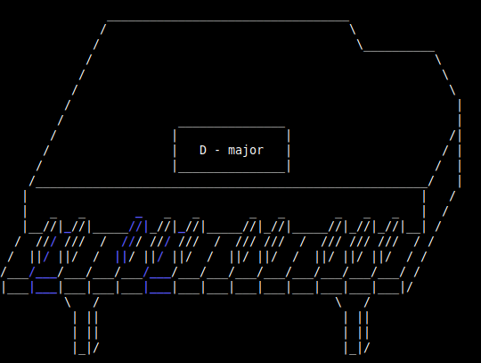
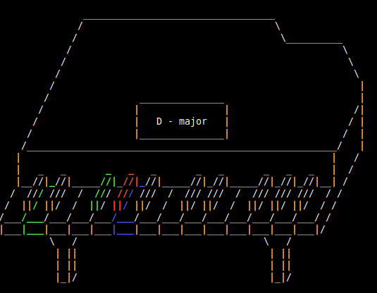

# chord test

A program with which you can easily practice playing special chords or keys on a MIDI keyboard. Furthermore there is a TTS (text to speech) support.

**The MIDI module (`rtmidi`) is not supported on Windows!**

## Setup

1. `sudo apt update`

2. `sudo apt install python3-pip ffmpeg libasound2-dev`

3. `python3 -m pip install -r requirements.txt`

4. `python3 main.py`

## Preview

